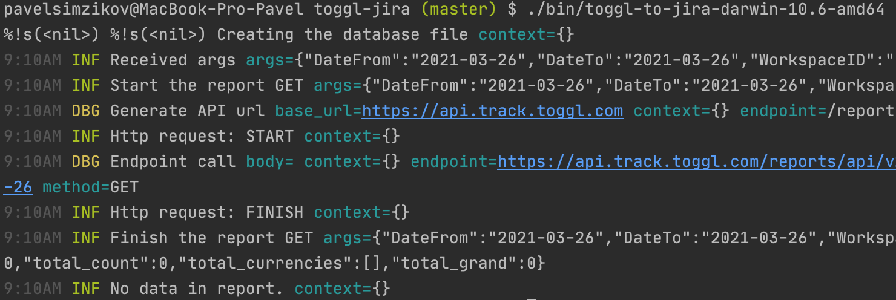
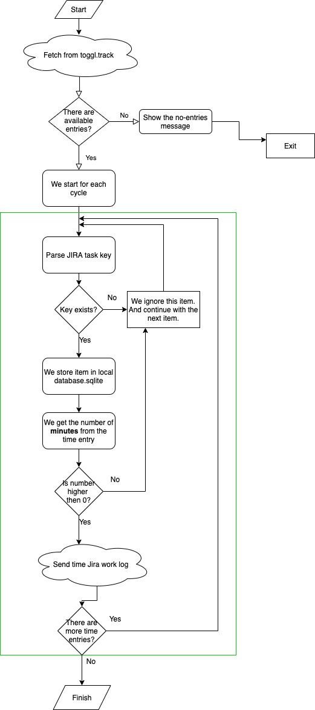
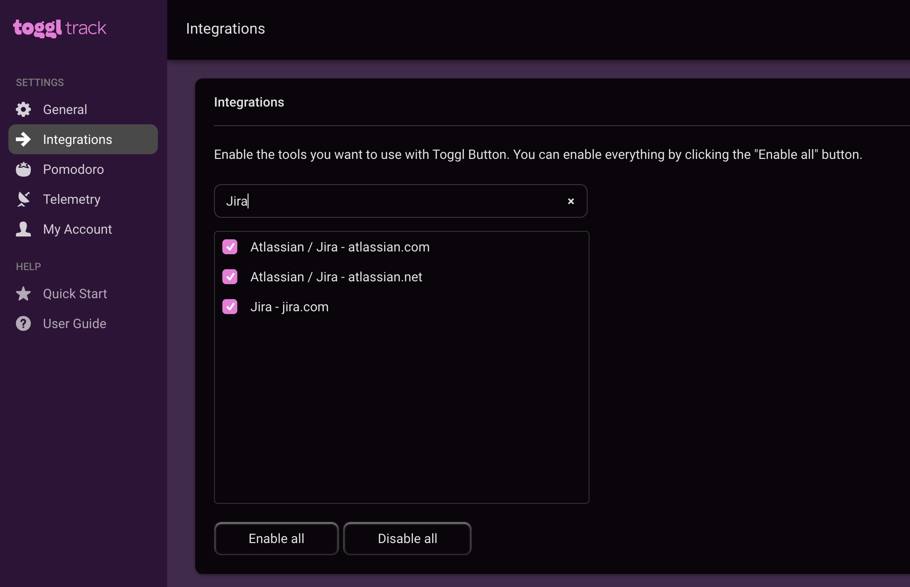

# Toggl.track to Jira

It is a small application which can be executed manually or via crontab. This application will export your [toggl.track](https://toggl.com/track/) report for selected time period to the work-logs of your Jira project. 
I wrote this app because, from my point of view the Jira work-log UI is not useful. You can install toggl.track browser extension and this will be way better than the "work-log" input form from Jira.

## Requirements
As each application, my app also requires some things to be done, before the execution.
1. You must have an account in Jira, so you can create the Jira auth token. [Click here to see how.](src/documentation/create-jira-auth-token.md)
2. Create the toggl.track API token. [Click here to see how.](src/documentation/create-toggl-api-token.md)

## Installation 
1. Go to [releases page](https://github.com/sharovik/toggl-to-jira/releases)
2. Download the archive called `release.zip`, unzip it and select the binary for your operating system from the `bin` folder and copy it to the `~/toggl-to-jira` folder in your system. Of course, it is up to you, what kind of folder select.
3. Make sure all required environment variables has been set in the `.env`
4. Using Command line tool, please go to `~/toggl-to-jira`(or your path) and run the following command:
   ``` 
    ./toggl-to-jira-{system}
   ```
   Please note, that after start the app will try to fetch the time entries from toggl API and send it to the Jira API.
   In my case there was no time entries to put in Jira, so here what I saw: 
   
   Done. 

### Env configuration
Recommendation is to copy contents from [.env.example](https://github.com/sharovik/toggl-to-jira/blob/master/.env.example) to the `.env` file in the `~/toggl-to-jira`(or your path) folder

In this dummy contents you can see the following variables:

#### For Toggl.track
* `TOGGL_API_TOKEN` - [see here how to create the token](src/documentation/create-toggl-api-token.md) 
* `TOGGL_API_URL` - the API URL https://api.track.toggl.com
* `TOGGL_DEFAULT_WORKSPACE_ID` - just go to your toggl.track account and visit Reports page, there in the address URL you will see the ID. Here is an example `https://track.toggl.com/reports/summary/{WORKSPACE_ID}/period/thisWeek`

#### For Jira
* `JIRA_APP_TOKEN` - [click here to see how generate the token](src/documentation/create-jira-auth-token.md)
* `JIRA_EMAIL` - your Jira account email
* `JIRA_BASE_URL` - the workspace URL https://your-company.atlassian.net

## How it works
The main approach is:
1. We fetch the data from the toggl.track API using `/reports/api/v2/details?workspace_id={workspace_id}&user_agent={user_agent}&since={date_from}&until={date_to}`
2. For each time entry we try to get the number of minutes and send the work log

Please, also have a look at the flowchart diagram:


## Available arguments
1. `date_from` - The starting date for the filter export. Please use next format: YYYY-MM-DD (default "2021-03-27")
2. `date_to` - The ending date for the filter export. Please use next format: YYYY-MM-DD (default "2021-03-27")
3. `workspace_id` - The workspace ID which should be used for the toggl.track data report generation. By default, will be used the ID from TOGGL_DEFAULT_WORKSPACE_ID environment variable.

Please use `--help` for more details.

## When app ignore time entries from toggl.track?
There are conditions, when the application ignore the received time entry:

1. The app already processed the time entry
2. In description of the time entry we could not find the Jira Task key. The task key example `KEY-1100`
3. The number of minutes spent is less the 1

## Troubleshooting

**Cannot run the app in MacOS Big Sur**
1. Make sure you allow to application execution in `Security & Privacy` settings
2. Make sure you move your application to the folder outside of base system folders. Eg: `~/Downloads` it is a system folder. Create a new folder in `~/` path and run the application from there.

**I receive error "It looks like there are problems with config. Stop running the script"** 
Please, make sure you defined all required environment variables. You can find the list of them in `.env.example`.

## My Setup
I would recommend use this application with combination of toggl.track browser extension, [which you can find here](https://toggl.com/track/jira-time-tracking/). And also I would recommend to set the crontab event for your application execution, so you will not care about the work-log sync anymore. 

The same thing I did on my PC. I installed the app into crontab to send the Jira report every 2 hours, so I don't bombard Jira and Toggl.track APIs. Plus, in my browser I installed the Toggl.track browser extension and enabled in the extension settings Jira support like in the image below:

At the end, for all tasks in Jira I have a button to start/stop the timer and all my working hours are in sync. It is free and very useful. 
