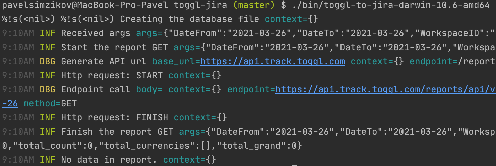
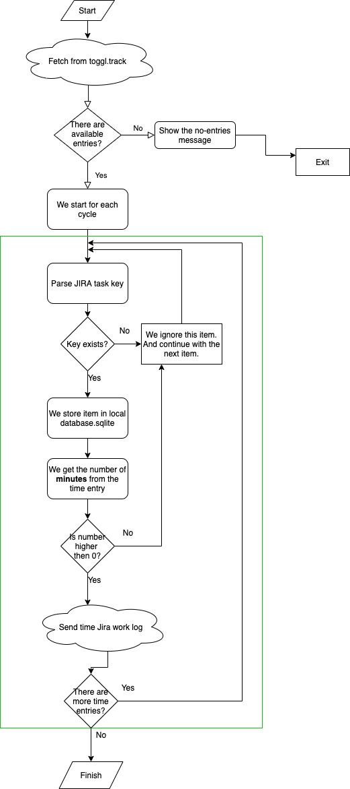
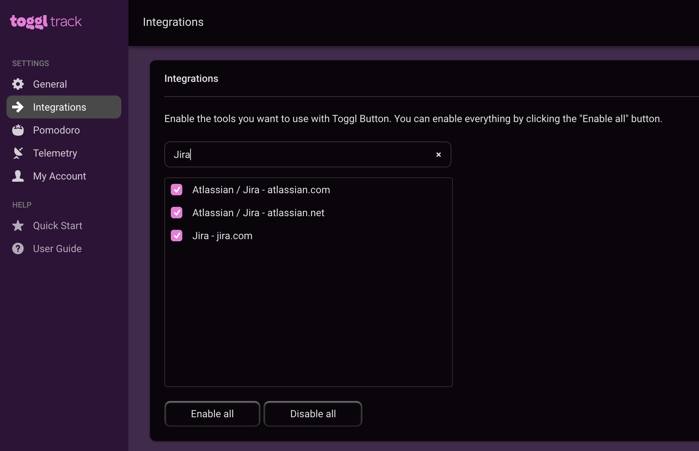

# Toggl.track to Jira

It is a small application which can be executed manually or via crontab. This application will export your [toggl.track](https://toggl.com/track/) report for selected period to the work-logs of your Jira project. I wrote this app because I don't like the put my work-log time in Jira - it is annoying, and it can be automated.

## Requirements
As each application, my app also requires some things to be done, before the execution.
1. You must have an account in Jira, so you can create the Jira auth token. [Click here to see how to generate a token.](documentation/create-jira-auth-token.md)
2. Create the toggl.track API token. [Click here to see how to create a token.](documentation/create-toggl-api-token.md)
3. You should have installed the sqlite on your system.
    You can use this command for ubuntu
    ```
    sudo apt-get install sqlite3 libsqlite3-dev
    ```
    Or by using brew
    ```
    brew install sqlite
    ```
    Or for centos
    ```
    sudo yum install sqlite
    ```
   
## Installation 
1. Download the binary for your system from `bin/` to the `~/toggl-to-jira` folder in your system. Of course, it is up to you, what kind of folder select.
2. Make sure all needed environment variables has been set in the `.env`.
3. Using Command line tool, please go to `~/toggl-to-jira`(or your path) and run the following command:
   ``` 
    ./{your-binary}
   ```
   Please note, that after start the app will try to fetch the time entries from toggl API and send it to the Jira API.
   In my case there was no time entries to put in Jira, so here what I saw: 
   
   Done. 

## How it works
The main approach is:
1. We fetch the data from the toggl.track API using `/reports/api/v2/details?workspace_id={workspace_id}&user_agent={user_agent}&since={date_from}&until={date_to}`
2. For each time entry we try to get the number of minutes and send the work log

Please, also have a look at the flowchart diagram:


## Available arguments
  `-date_from` string
        The starting date for the filter export. Please use next format: YYYY-MM-DD (default "2021-03-27")
  `-date_to` string
        The ending date for the filter export. Please use next format: YYYY-MM-DD (default "2021-03-27")
  `-workspace_id` string
        The workspace ID which should be used for the toggl.track data report generation. By default, will be used the ID from TOGGL_DEFAULT_WORKSPACE_ID environment variable.
Please use `--help` for more details.

## When app ignore time entries from toggl.track?
There are conditions, when we ignore the received time entry:

1. We already processed the time entry
2. In description of the time entry we could not find the Jira Task key
3. The number of minutes spent is less the 1

## Troubleshooting

**Cannot run the app in MacOS Big Sur**
1. Make sure you allow to application execution in `Security & Privacy` settings
2. Make sure you move your application to the folder outside of base system folders. Eg: `~/Downloads` it is a system folder. Create a new folder in `~/` path and run the application from there.

**I receive error "It looks like there are problems with config. Stop running the script"** 
Please, make sure you defined all required environment variables. You can find the list of them in `.env.example`.

## My Setup
I would recommend use this application with combination of toggl.track browser extension, [which you can find here](https://toggl.com/track/jira-time-tracking/). And also I would recommend to set the crontab event for your application execution, so you will not care about the work-log sync anymore. 

The same thing I did on my PC. I installed the app into crontab to send the Jira report every 2 hours, so I don't bombard Jira and Toggl.track APIs. Plus, in my browser I installed the Toggl.track browser extension and enabled in the extension settings Jira support like in the image below:

At the end, in all my tasks in Jira I have a button to start/stop the timer and all my working hours are in sync. Plus I paid nothing for that. 
